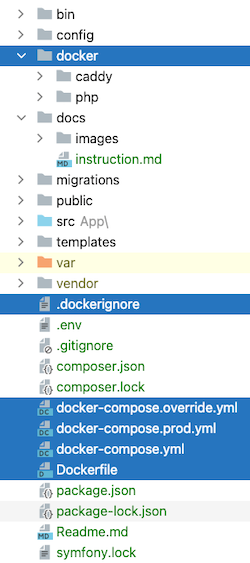
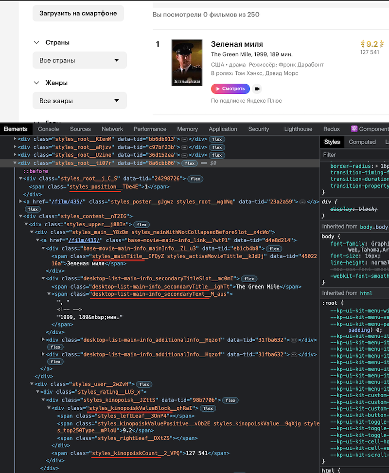
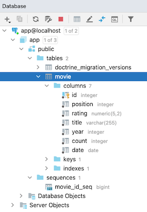
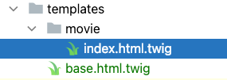
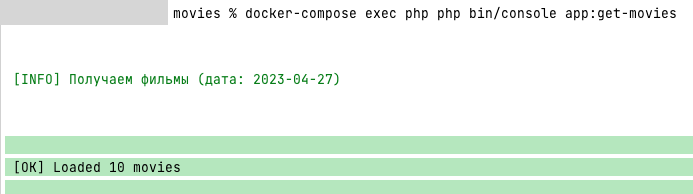
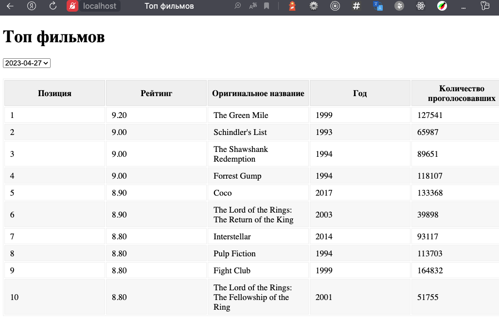

## Задание

Необходимо написать скрипт, собирающий данные с рейтинга Кинопоиска
(http://www.kinopoisk.ru/top/) в БД.

Данные которые надо получить:
- позицию;
- рейтинг;
- оригинальное название;
- год;
- кол-во проголосовавших людей.

Также нужно добавить соответствующие поля в БД для выборки рейтинга на определенную дату.
Скрипт должен быть написан с учетом возможности постановки в cron.

Cоздать базовую веб-страницу, выводящую топ-10 фильмов на указанную дату.
На ней должно присутствовать поле, где пользователь может указать дату выборки.

При выгрузке данных из СУБД должен быть использован кэширующий слой, чтобы избежать запросов к базе, 
каждый раз, когда рейтинг должен быть показан.

Критерии оценки:
- Symfony
- чистый, читаемый, структурируемый php код,
- объектное ориентированный дизайн
- схема базы данных
- чистота верстки

# Установка Symfony
```shell
symfony new movies --version="6.2.*"
cd movies
```

# Настроим docker для работы
Воспользуемся репозиторием `https://github.com/api-platform/api-platform` и возьмем из него конфиги.
Поправим конфиги и оставим только php и веб сервер caddy.



Запуск:
```shell
docker-compose up
```

Установим пакеты
```shell
docker-compose exec php composer require symfony/monolog-bundle
docker-compose exec php composer require predis/predis
docker-compose exec php composer require symfony/orm-pack
docker-compose exec php composer require symfony/twig-bundle
docker-compose exec php composer require symfony/security-csrf
docker-compose exec php composer require symfony/symfony/form
docker-compose exec php composer require --dev symfony/maker-bundle
docker-compose exec php composer require --dev symfony/debug-bundle
docker-compose exec php composer require symfony/webpack-encore-bundle
```


# Сбор данных с сайта (web scraping)
Т.к мы планируем использовать скрипт для сбора данных через cron, поэтому
создадим команду для получения фильмов:
```shell
docker-compose exec php php bin/console make:command app:get-movies
```
Получили файл команды:
```
src/Command/GetMoviesCommand.php
```
Воспользуемся библиотекой `php-webdriver/webdriver` которая будет подключаться к удаленному хосту selenium-а и выполнения js:
```shell
docker-compose exec php composer require php-webdriver/webdriver`
```

Добавим в `docker-compose` service chrome(selenium/standalone-chrome:latest).


Создадим скрипт для сбора данных со страницы:
```
config/scraping_scripts/movies.js
```
Для этого проанализируем страницу и найдем элементы из которых будем собирать данные.



Создадим сервис для получения данных со страницы:
```
src/Service/MovieScraper.php
```
Воспользуемся этим сервисом в команде `app:get-movies`.

Для сбора фильмов необходимо запустить команду:

```shell
docker-compose exec php php bin/console app:get-movies
```
Создадим Модель Movie для хранения данных:
```shell
docker-compose exec php php bin/console make:entity Movie
```
После применения создадутся два файла 
- `src/Entity/Movie.php`
- `src/Repository/MovieRepository.php`

Создадим миграцию:
```shell
docker-compose exec php php bin/console make:migration
```
Файл миграции имеет вид `migrations/Version20230426131614.php`.

Применим миграцию:
```shell
docker-compose exec php php bin/console doctrine:migrations:migrate
```

Подключимся к БД и посмотрим что появилось



Создадим контроллер для отображения списка фильмов:
```shell
docker-compose exec php php bin/console make:controller Movie
```

Создадим сервис для получения данных из БД и кеширования результата в Redis:
```
src/Service/MovieManager.php
```

В контроллере `MovieController.php`:
 - создадим форму для отображения списка доступных дат;
 - получим фильмы на основании выбранной даты используя сервис `MovieManager`;
 - подготовим шаблон страницы.


Для создания формы воспользуемся генератором формы:
```shell
docker-compose exec php php bin/console make:form Movie
```
Получим файл: `src/Form/MovieType.php` 

Создадим простые шаблоны страницы:




### Посмотрим что получилось:

Сбор фильмов:




Страница фильмов:


